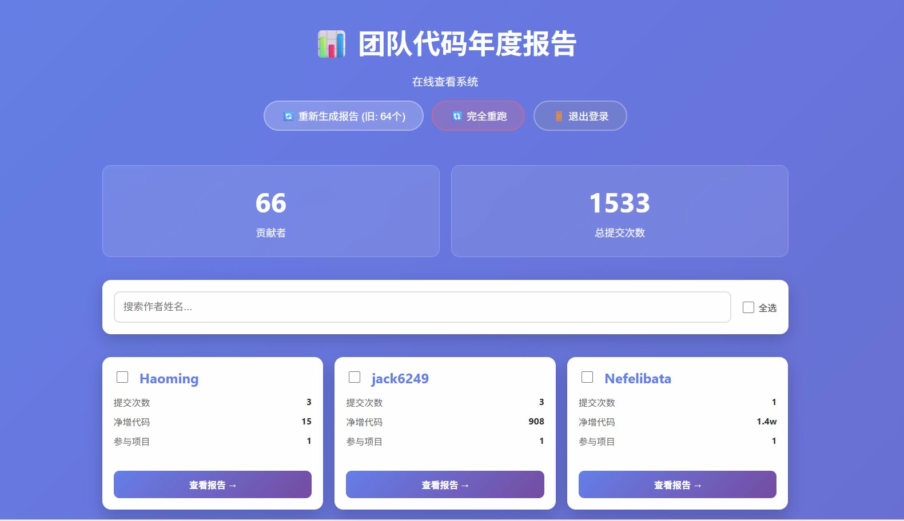
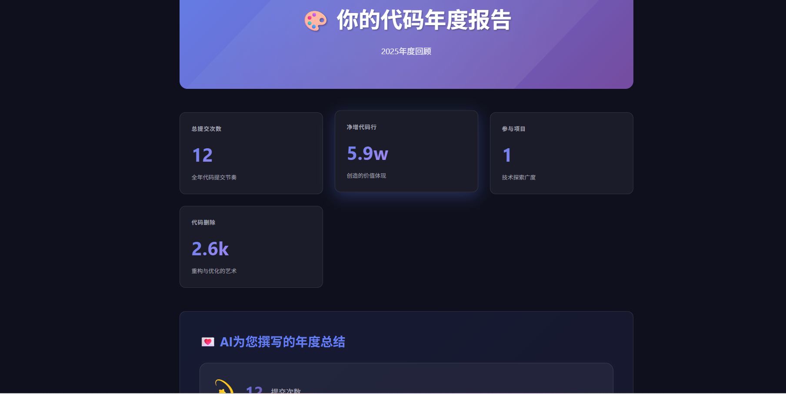

# 代码年度报告生成器

> 🎯 为 Git 仓库生成精美的年度代码报告，支持多人协作、智能分片存储、LLM 驱动的个性化文案

[](https://www.python.org/)
[](LICENSE)
[](https://github.com/yourusername/code-year-report/issues)

## ✨ 特性

### 核心功能

- 📊 **多维度数据分析**
  - 提交统计、代码行数、编程语言分布
  - 时间分布分析（按小时、星期、月份）
  - 代码质量指标（重构比例、精简代码）
  - 项目贡献排行

- 🎨 **精美的报告展示**
  - 多种报告模板：经典、交互式、故事模式、滚动照片墙
  - 响应式设计，支持移动端访问
  - 动态数据可视化

- 🤖 **AI 智能文案**
  - 支持 OpenAI、Anthropic、Azure OpenAI
  - 本地 LLM 服务支持（如 Ollama）
  - 自动生成个性化的年度总结

- ⚡ **高性能处理**
  - 多级并发：仓库级、提交级、LLM 并发
  - 智能缓存：Git 扫描结果缓存
  - 断点续跑：支持中断后继续生成

- 💾 **智能存储**
  - UUID 访问：隐私友好的报告链接
  - 自动分片：超大文件自动分片存储（单文件 ≤ 1MB）
  - 数据完整：保留所有提交记录，不丢失数据

- 🔐 **权限管理**
  - 管理员登录
  - 报告公开访问（可选）
  - 会话管理

### 技术亮点

- **Web 界面管理**：直观的管理界面，实时查看生成进度
- **并发优化**：支持多仓库并发扫描、单个仓库并发分析
- **LLM 并发**：同时生成多个作者的报告
- **自动重试**：LLM 请求失败自动重试机制
- **配置灵活**：YAML 配置文件，支持多种 Git 仓库发现方式

## 📸 预览

### 总览页面


### 个人报告


### 视频展示


## 🚀 快速开始

<details>
<summary><b>5 分钟快速上手</b></summary>

### 1. 安装依赖

```bash
pip install -r requirements.txt
```

### 2. 配置项目

编辑 `config/config.yaml`，修改项目路径：

```yaml
projects:
  - path: "/path/to/your/git/repo"
    name: "my-project"

report_year: 2025
```

### 3. 启动服务

```bash
python src/server.py
```

### 4. 访问界面

打开浏览器访问：http://localhost:8000

- 默认账号：`admin`
- 默认密码：`admin`

### 5. 生成报告

登录后点击"生成报告"按钮，等待生成完成即可。

</details>

<details>
<summary><b>详细安装指南</b></summary>

### 环境要求

- Python 3.8+
- Git 2.0+

### 安装

```bash
# 克隆项目
git clone https://github.com/yourusername/code-year-report.git
cd code-year-report

# 安装依赖
pip install -r requirements.txt
```

### 安装

```bash
# 克隆项目
git clone https://github.com/yourusername/code-year-report.git
cd code-year-report

# 安装依赖
pip install -r requirements.txt
```

### 配置

编辑 `config/config.yaml`：

```yaml
# 项目路径配置
projects:
  - path: "/path/to/your/git/repo"
    name: "my-project"

# 报告年份
report_year: 2025

# LLM 配置（可选）
llm:
  provider: "openai"
  model: "gpt-4"
  api_key: "your-api-key"
  base_url: "https://api.openai.com/v1"

# 并发配置
concurrency:
  repo_workers: 4
  commit_workers: 8
  llm_workers: 3
```

### 运行

```bash
# 启动 Web 服务器
python src/server.py --port 8000

# 访问 http://localhost:8000
# 使用管理员账号登录（默认：admin/admin）
# 点击"生成报告"开始生成
```

</details>

更多详细信息请查看 [快速启动指南](QUICKSTART.md)

## 📖 使用指南

### 1. 配置项目路径

支持三种方式配置 Git 仓库：

```yaml
projects:
  # 方式1：指定单个仓库
  - path: "/path/to/repo"
    name: "my-repo"

  # 方式2：自动发现（推荐）
  - path: "/path/to/projects"
    name: "auto-discover"

  # 方式3：混合使用
  - path: "/specific/repo"
    name: "specific"
  - path: "/projects/dir"
    name: "auto"
```

### 2. 生成报告

**Web 界面生成**：

1. 访问 `http://localhost:8000`
2. 登录管理界面
3. 点击"生成报告"按钮
4. 实时查看生成进度

**命令行生成**：

```bash
# 直接生成报告
python src/generate_reports.py
```

### 3. 查看报告

- **总览页面**：`http://localhost:8000` - 查看所有作者列表
- **个人报告**：`http://localhost:8000/report/{uuid}` - 查看特定作者的详细报告
- **API 接口**：
  - `GET /api/authors` - 获取作者列表
  - `GET /api/author/{uuid}` - 获取作者详细数据
  - `GET /api/progress` - 获取生成进度

### 4. 报告模板切换

支持通过 URL 参数切换不同模板：

```
/report/{uuid}                      # 默认模板（照片墙滚动）
/report/{uuid}?style=classic        # 经典模板
/report/{uuid}?style=interactive    # 交互式模板
/report/{uuid}?style=story          # 故事模板
/report/{uuid}?style=scroll         # 滚动照片墙模板
```

## 🏗️ 项目结构

```
code-year-report/
├── config/                 # 配置文件
│   ├── config.yaml        # 主配置文件
│   └── author_mapping.yaml # 作者邮箱映射（可选）
├── src/                    # 源代码
│   ├── git_collector.py   # Git 数据收集
│   ├── data_analyzer.py   # 数据分析
│   ├── llm_client.py      # LLM 客户端
│   ├── generate_reports.py # 报告生成
│   ├── server.py          # Web 服务器
│   └── report_generator.py # 核心逻辑
├── static/                 # 静态资源
│   ├── css/
│   ├── js/
│   └── images/
├── templates/              # HTML 模板
│   ├── overview.html      # 总览页面
│   ├── login.html         # 登录页面
│   ├── report.html        # 经典报告模板
│   ├── report_story_scroll.html  # 滚动照片墙模板
│   └── ...
├── reports/                # 生成的报告（.gitignore）
│   ├── {uuid}.json       # 主报告文件
│   ├── {uuid}_p0.json    # 项目分片
│   ├── report_index.json # 报告索引
│   └── uuid_mapping.json # UUID 映射
├── md/                     # 设计文档
│   ├── uuid-migration.md
│   ├── concurrency-improvements.md
│   └── json-file-chunking.md
└── README.md
```

## 🔧 高级配置

### 并发控制

```yaml
concurrency:
  repo_workers: 4      # 同时扫描的仓库数
  commit_workers: 8    # 单个仓库的提交分析并发数
  llm_workers: 3       # 同时生成的 LLM 报告数
  max_workers: 20      # 总体最大并发数
```

**建议配置**：
- CPU 核心数 ≤ 8：`repo_workers: 4, commit_workers: 8`
- CPU 核心数 > 8：`repo_workers: 8, commit_workers: 16`
- LLM 性能强：`llm_workers: 5`
- LLM 性能弱：`llm_workers: 1-2`

### LLM 配置

**OpenAI**：

```yaml
llm:
  provider: "openai"
  model: "gpt-4"
  api_key: "sk-..."
  base_url: "https://api.openai.com/v1"
  timeout: 120
  max_retries: 2
  retry_delay: 5
```

**本地 LLM（如 Ollama）**：

```yaml
llm:
  provider: "openai"
  model: "llama2"
  api_key: "not-needed"
  base_url: "http://localhost:11434/v1"
  timeout: 300
  max_retries: 1
```

### 作者筛选

只生成特定作者的报告：

```yaml
authors:
  - "Zhang San"
  - "zhangsan@example.com"
```

留空则包含所有作者。

## 📊 数据存储机制

### UUID 访问

每个作者生成唯一的 UUID，报告 URL 格式：

```
/report/a1b2c3d4-e5f6-4a5b-8c7d-9e0f1a2b3c4d
```

优点：
- 隐私友好，不暴露邮箱和姓名
- URL 简洁，易于分享
- 支持公开访问（无需登录）

### 智能分片存储

当报告文件超过 1MB 时，自动启用分片：

```
reports/
├── a1b2c3d4-xxx.json          # 主文件（meta + summary）
├── a1b2c3d4-xxx_p0.json      # 项目 0 的提交
├── a1b2c3d4-xxx_p1.json      # 项目 1 的提交
└── a1b2c3d4-xxx_p2_c0.json  # 项目 2 的分片 0
```

**特性**：
- 数据完整：保留所有提交记录
- 自动合并：服务器自动加载并合并分片
- 透明处理：对前端完全透明

详见 [JSON 文件分片存储文档](md/json-file-chunking.md)

## 🐛 常见问题

### 1. LLM 请求超时

**问题**：生成报告时 LLM 请求超时

**解决**：
```yaml
llm:
  timeout: 300  # 增加超时时间到 5 分钟
  max_retries: 2  # 增加重试次数
```

### 2. 生成速度慢

**问题**：报告生成速度慢

**解决**：
- 增加 `llm_workers`（如果 LLM 性能好）
- 减少 `max_commits` 限制（在 `generate_reports.py` 中）
- 使用本地 LLM（避免网络延迟）

### 3. 内存占用高

**问题**：生成大量报告时内存占用高

**解决**：
- 减少 `commit_workers` 和 `repo_workers`
- 分批生成报告（配置 `authors` 筛选）

### 4. 分片文件加载失败

**问题**：报告显示不完整

**解决**：
```bash
# 检查所有分片文件是否存在
ls -la reports/xxx_p*.json

# 重新生成报告
python src/generate_reports.py
```

## 📈 性能优化

### 缓存机制

Git 扫描结果缓存：
```bash
# 缓存位置
.git_scan_cache/

# 清除缓存
rm -rf .git_scan_cache/
```

### 并发优化建议

| 场景 | repo_workers | commit_workers | llm_workers |
|------|--------------|----------------|-------------|
| 小型项目（< 10k 提交） | 4 | 8 | 3 |
| 中型项目（10-50k 提交） | 4 | 16 | 5 |
| 大型项目（> 50k 提交） | 8 | 16 | 1-2 |

### LLM 成本优化

- 使用本地 LLM（零成本）
- 启用缓存（避免重复请求）
- 减少并发（避免 API 限流）

## 🤝 贡献指南

欢迎提交 Issue 和 Pull Request！

### 开发指南

```bash
# 安装开发依赖
pip install -r requirements-dev.txt

# 运行测试
pytest tests/

# 代码格式化
black src/
```

### 提交规范

- feat: 新功能
- fix: 修复 bug
- docs: 文档更新
- style: 代码格式
- refactor: 重构
- test: 测试相关
- chore: 构建/工具相关

## 📝 开发路线图

### v2.0 计划

- [ ] 支持更多 Git 平台（GitHub、GitLab、Gitee）
- [ ] 团队对比功能
- [ ] 导出 PDF 报告
- [ ] 自定义主题
- [ ] 国际化支持（英文、日文）

### v1.5 计划

- [ ] 并行加载分片文件
- [ ] 前端按需加载
- [ ] 数据压缩存储
- [ ] 更多图表类型

## 📄 许可证

MIT License

## 🙏 致谢

- [GitPython](https://github.com/gitpython-developers/GitPython) - Git 操作
- [Chart.js](https://www.chartjs.org/) - 数据可视化
- [OpenAI API](https://openai.com/) - AI 文案生成

## 📄 许可证

本项目采用 MIT 许可证 - 详见 [LICENSE](LICENSE) 文件

## 📮 联系方式

- 问题反馈：[GitHub Issues](https://github.com/yourusername/code-year-report/issues)
- 功能建议：[GitHub Discussions](https://github.com/yourusername/code-year-report/discussions)

---

<div align="center">

**⭐ 如果这个项目对你有帮助，请给个 Star！**

Made with ❤️ by Code Year Report Contributors

</div>
