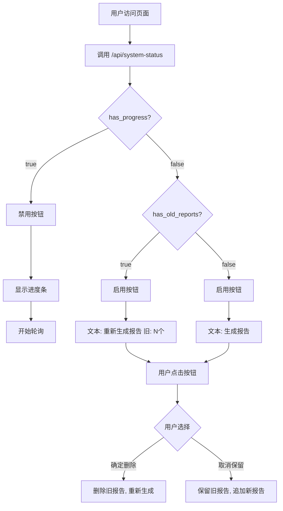

# 智能按钮状态管理功能说明

## 📋 问题描述

**用户反馈**："报告按钮现在还是不能点击，继续需要结合任务状态和文件状态，兼容老报告文件；开始新任务则删除老的报告文件，注意续跑不用删除，因为本来就还没有生成"

## 🔍 需求分析

### 核心需求

1. **按钮状态需要综合判断**
   - 检查任务状态（是否正在生成）
   - 检查文件状态（是否有旧报告）
   - 根据综合状态决定按钮文本和是否可点击

2. **智能删除旧报告**
   - 开始新任务时：询问是否删除旧报告
   - 重新开始（restart）：删除旧报告
   - 继续生成（continue）：不删除旧报告（因为本来就还没生成完）

3. **兼容老报告文件**
   - 能够识别已存在的报告文件
   - 提示用户有多少个旧报告
   - 让用户选择删除或保留

### 场景分析

#### 场景1：没有任务，没有旧报告
```
状态：
  - has_progress: false
  - has_old_reports: false

按钮文本："🔄 生成报告"
按钮状态：可点击

点击后：直接开始生成
```

#### 场景2：没有任务，有旧报告
```
状态：
  - has_progress: false
  - has_old_reports: true
  - old_report_count: 10

按钮文本："🔄 重新生成报告 (旧: 10个)"
按钮状态：可点击

点击后：弹窗询问
  - 确定 → 删除旧报告，重新生成
  - 取消 → 保留旧报告，追加新报告
```

#### 场景3：有正在进行的任务
```
状态：
  - has_progress: true
  - task_status: 'generating'

按钮文本："⏳ 生成中..."
按钮状态：禁用（不可点击）

自动显示进度条，轮询更新
```

#### 场景4：续跑（继续历史任务）
```
操作：用户选择"继续生成"

行为：
  - 不删除旧报告（因为本来就没生成完）
  - 从断点继续
  - action: 'continue'
```

#### 场景5：重新开始（删除旧报告）
```
操作：用户选择"重新开始"

行为：
  - 删除进度文件
  - 删除所有旧报告文件（*.json，但不包括.*）
  - action: 'restart'
  - 从头开始生成
```

## 🔧 实现方案

### 1. 新增后端API：`/api/system-status`

**文件**: [src/server.py](src/server.py) 第273-308行

```python
def send_system_status_api(self):
    """发送系统状态API - 检查任务状态和文件状态"""
    project_root = Path(__file__).parent.parent
    progress_file = project_root / 'reports' / '.progress.json'
    reports_dir = project_root / 'reports'

    # 检查进度文件
    has_progress = False
    task_status = None
    if progress_file.exists():
        try:
            with open(progress_file, 'r', encoding='utf-8') as f:
                progress = json.load(f)
            task_status = progress.get('status')
            if task_status == 'generating':
                has_progress = True
        except:
            pass

    # 检查是否有旧的报告文件
    has_old_reports = False
    old_report_count = 0
    if reports_dir.exists():
        # 统计JSON报告文件数量（排除.开头的隐藏文件）
        json_files = list(reports_dir.glob('*.json'))
        old_report_count = len([f for f in json_files if not f.name.startswith('.')])
        has_old_reports = old_report_count > 0

    response = {
        'task_status': task_status,  # 'generating', 'completed', 或 None
        'has_progress': has_progress,
        'has_old_reports': has_old_reports,
        'old_report_count': old_report_count,
        'can_generate': not has_progress  # 只有在没有任务进行时才能生成
    }
    self.send_json_response(response)
```

**返回数据格式**：
```json
{
  "task_status": "generating" | "completed" | null,
  "has_progress": true | false,
  "has_old_reports": true | false,
  "old_report_count": 10,
  "can_generate": true | false
}
```

### 2. 后端删除旧报告逻辑

**文件**: [src/server.py](src/server.py) 第379-445行

#### 重新开始（删除旧报告）
```python
elif has_history and action == 'restart':
    # 重新开始，删除历史进度和旧报告文件
    logger.info("重新开始生成，清除历史进度和旧报告文件")

    # 删除进度文件
    if progress_file.exists():
        progress_file.unlink()

    # 删除旧的报告文件
    reports_dir = project_root / 'reports'
    if reports_dir.exists():
        # 删除所有JSON报告文件（但保留隐藏文件如.progress.json）
        json_files = list(reports_dir.glob('*.json'))
        deleted_count = 0
        for json_file in json_files:
            if not json_file.name.startswith('.'):
                try:
                    json_file.unlink()
                    deleted_count += 1
                except Exception as e:
                    logger.warning(f"删除旧报告文件失败 {json_file}: {e}")
        logger.info(f"已删除 {deleted_count} 个旧报告文件")
```

#### 开始新任务（删除旧报告）
```python
else:
    # 没有历史任务，开始新任务（需要删除旧报告文件）
    logger.info("开始新的生成任务")

    # 删除旧的报告文件
    reports_dir = project_root / 'reports'
    if reports_dir.exists():
        # 删除所有JSON报告文件（但保留隐藏文件）
        json_files = list(reports_dir.glob('*.json'))
        deleted_count = 0
        for json_file in json_files:
            if not json_file.name.startswith('.'):
                try:
                    json_file.unlink()
                    deleted_count += 1
                except Exception as e:
                    logger.warning(f"删除旧报告文件失败 {json_file}: {e}")
        if deleted_count > 0:
            logger.info(f"已删除 {deleted_count} 个旧报告文件")
```

**注意**：
- 只删除 `*.json` 文件
- 保留 `.*` 开头的隐藏文件（如 `.progress.json`, `.resume_checkpoint.json`）
- 续跑时（action='continue'）不删除任何文件

### 3. 前端页面加载时智能判断按钮状态

**文件**: [static/js/overview.js](static/js/overview.js) 第6-58行

```javascript
document.addEventListener('DOMContentLoaded', async function() {
    // 检查系统状态（任务状态 + 文件状态）
    try {
        const statusResponse = await fetch('/api/system-status');
        const statusData = await statusResponse.json();

        const generateBtn = document.getElementById('generateBtn');
        if (!generateBtn) {
            loadAuthorsData();
            return;
        }

        // 如果有正在进行的任务，自动显示进度条并禁用按钮
        if (statusData.has_progress) {
            console.log('检测到正在进行的任务，自动显示进度条');

            // 禁用按钮并显示"生成中"
            generateBtn.disabled = true;
            generateBtn.textContent = '⏳ 生成中...';

            // 获取进度详情并显示
            const progressResponse = await fetch('/api/progress');
            const progressData = await progressResponse.json();
            displayProgress(progressData);

            // 开始轮询进度更新
            checkProgress();
        } else {
            // 没有正在进行的任务，启用按钮
            generateBtn.disabled = false;

            // 根据是否有旧报告显示不同文本
            if (statusData.has_old_reports) {
                generateBtn.textContent = `🔄 重新生成报告 (旧: ${statusData.old_report_count}个)`;
            } else {
                generateBtn.textContent = '🔄 生成报告';
            }
        }
    } catch (error) {
        console.error('检查系统状态失败:', error);
        // 出错时也要重置按钮状态
        const generateBtn = document.getElementById('generateBtn');
        if (generateBtn) {
            generateBtn.disabled = false;
            generateBtn.textContent = '🔄 生成报告';
        }
    }

    loadAuthorsData();
});
```

### 4. 前端点击生成时的智能处理

**文件**: [static/js/overview.js](static/js/overview.js) 第60-199行

```javascript
async function generateReports() {
    const btn = document.getElementById('generateBtn');

    try {
        // 首先检查系统状态（任务状态 + 文件状态）
        const statusResponse = await fetch('/api/system-status');
        const statusData = await statusResponse.json();

        // 如果有正在进行的任务，让用户选择
        if (statusData.has_progress) {
            // 显示续跑或重新开始的对话框
            // ...
        }

        // 没有正在进行的任务，检查是否有旧报告
        if (statusData.has_old_reports) {
            const userChoice = confirm(
                `发现 ${statusData.old_report_count} 个旧报告文件\n\n` +
                `点击"确定"删除旧报告并重新生成\n` +
                `点击"取消"保留旧报告并追加新报告`
            );

            if (userChoice) {
                // 删除旧报告并重新生成 (action: 'restart')
                // ...
            } else {
                // 保留旧报告，开始新任务
                // ...
            }
        } else {
            // 没有旧报告，直接开始生成
            // ...
        }
    } catch (error) {
        // 错误处理
    }
}
```

## 📊 决策流程图



## ✅ 功能特点

### 1. 智能按钮文本

| 状态 | 按钮文本 | 可点击? |
|------|----------|---------|
| 无任务，无旧报告 | 🔄 生成报告 | ✅ |
| 无任务，有旧报告 | 🔄 重新生成报告 (旧: N个) | ✅ |
| 任务进行中 | ⏳ 生成中... | ❌ |
| 任务完成 | 🔄 生成报告 | ✅ |

### 2. 用户友好的提示

**续跑提示**：
```
发现未完成的生成任务:
当前进度: 正在生成 XXX
完成度: 5/10 (50.0%)

点击"确定"继续生成
点击"取消"重新开始
```

**旧报告提示**：
```
发现 10 个旧报告文件

点击"确定"删除旧报告并重新生成
点击"取消"保留旧报告并追加新报告
```

### 3. 安全的文件删除

**删除规则**：
- ✅ 删除所有 `*.json` 报告文件
- ✅ 保留 `.*` 开头的隐藏文件
- ✅ 保留 `.progress.json`（进度文件）
- ✅ 保留 `.resume_checkpoint.json`（检查点文件）
- ✅ 异常处理，删除失败不影响主流程

**不删除的情况**：
- ❌ 续跑时（action='continue'）不删除
- ❌ 用户选择"保留旧报告"时不删除

## 🧪 测试场景

### 测试1：全新生成

```bash
1. 删除所有报告文件
2. 访问页面
3. 检查按钮：显示"🔄 生成报告"
4. 点击按钮
5. 直接开始生成（无提示）
```

**预期结果**：
- ✅ 按钮文本正确
- ✅ 直接开始生成
- ✅ 无旧报告提示

### 测试2：有旧报告

```bash
1. 确保存在一些报告文件（如5个）
2. 访问页面
3. 检查按钮：显示"🔄 重新生成报告 (旧: 5个)"
4. 点击按钮
5. 选择"确定"删除
```

**预期结果**：
- ✅ 按钮显示旧报告数量
- ✅ 弹窗提示
- ✅ 确定后删除旧报告
- ✅ 重新开始生成

### 测试3：保留旧报告

```bash
1. 确保存在一些报告文件（如5个）
2. 访问页面
3. 点击按钮
4. 选择"取消"保留
```

**预期结果**：
- ✅ 不删除旧报告
- ✅ 追加新报告
- ✅ 最终报告数 = 旧报告 + 新报告

### 测试4：续跑不删除

```bash
1. 生成过程中中断（如生成到3/10）
2. 访问页面
3. 检查按钮：显示"⏳ 生成中..."
4. 按钮禁用
5. 自动显示进度条
```

**预期结果**：
- ✅ 按钮禁用
- ✅ 自动显示进度条
- ✅ 继续生成不删除旧报告

### 测试5：重新开始删除

```bash
1. 生成过程中中断
2. 访问页面
3. 点击按钮（虽然显示禁用，但通过代码可以调用）
4. 或手动点击刷新后点击
5. 选择"取消"重新开始
```

**预期结果**：
- ✅ 删除所有旧报告
- ✅ 删除进度文件
- ✅ 从头开始生成

## 📄 修改文件清单

### 后端
- **[src/server.py](src/server.py)**
  - 新增 `send_system_status_api()` 方法（第273-308行）
  - 新增 `/api/system-status` 路由（第63-66行）
  - 修改 `generate_report()` 方法，添加删除旧报告逻辑（第379-445行）

### 前端
- **[static/js/overview.js](static/js/overview.js)**
  - 修改页面加载初始化逻辑（第6-58行）
  - 修改 `generateReports()` 函数，添加智能判断（第60-199行）

## ✅ 总结

### 问题
按钮状态需要综合判断任务状态和文件状态，旧报告文件需要智能处理

### 解决方案
1. ✅ 新增 `/api/system-status` API，返回综合状态
2. ✅ 页面加载时检查状态，智能设置按钮文本和状态
3. ✅ 点击生成时根据状态提示用户
4. ✅ 重新开始时删除旧报告
5. ✅ 续跑时不删除旧报告
6. ✅ 开始新任务时询问是否删除旧报告

### 效果
- ✅ 按钮状态准确反映系统状态
- ✅ 用户可以清楚知道有多少旧报告
- ✅ 智能删除，避免混淆
- ✅ 兼容老报告文件
- ✅ 用户体验友好

---

**实现时间**: 2025-12-28
**版本**: v1.4.0
**作者**: Claude Code
