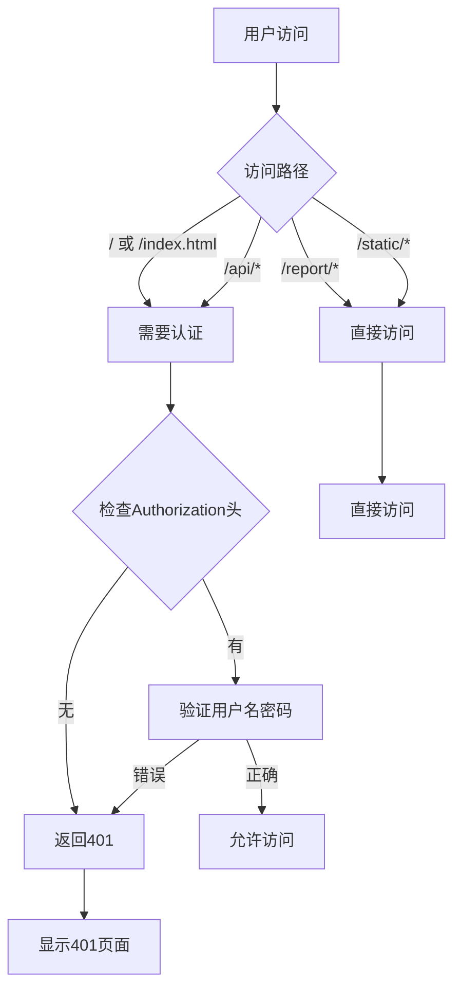

# 访问控制功能说明

## 📋 需求描述

**需求**：
- 只有admin可以进入 `http://192.168.3.31:8000` 管理页面
- 其他人只允许访问报告链接 `http://192.168.3.31:8000/report/{报告链接}`
- 报告链接不需要登录
- 非管理员只能访问report页面，不能访问其他任何页面

## 🔐 实现方案

### 1. 认证机制：HTTP Basic Authentication

使用HTTP Basic Authentication进行管理员认证。

### 2. 访问规则

| 路径 | 需要认证? | 说明 |
|------|----------|------|
| `/` | ✅ 是 | 管理主页，只有admin可访问 |
| `/index.html` | ✅ 是 | 管理主页，只有admin可访问 |
| `/api/*` | ✅ 是 | 所有API接口，只有admin可访问 |
| `/report/*` | ❌ 否 | 报告页面，任何人可访问 |
| `/static/*` | ⚠️ 条件性 | 只有来自report页面的请求可访问 |
| `/templates/*` | ⚠️ 条件性 | 只有来自report页面的请求可访问 |

### 3. 智能访问控制

**核心逻辑**：通过 `Referer` 头判断请求来源

```python
def can_access_without_auth(self, path):
    """判断是否可以在无认证的情况下访问"""
    # 报告页面本身不需要认证
    if path.startswith('/report/'):
        return True

    # 如果请求来自report页面，允许访问静态资源
    if self.is_referer_from_report():
        # 静态资源（CSS, JS, favicon等）
        if path.startswith('/static/'):
            return True
        # 模板文件
        if path.startswith('/templates/'):
            return True

    return False
```

**工作原理**：
1. 用户访问 `/report/xxx`
2. 页面加载，浏览器发送 `GET /static/css/style.css`，同时携带 `Referer: http://192.168.3.31:8000/report/xxx`
3. 服务器检查 `Referer` 头，确认请求来自report页面
4. 允许访问静态资源
5. 如果用户直接访问 `/static/css/style.css`（没有Referer或Referer不是report页面），则拒绝访问

### 4. 安全优势

**防止直接访问静态资源**：
```
✅ 允许: http://192.168.3.31:8000/report/xxx (报告页面)
   → 浏览器加载: http://192.168.3.31:8000/static/css/style.css
   → Referer: http://192.168.3.31:8000/report/xxx
   → 检查通过，允许访问

❌ 拒绝: http://192.168.3.31:8000/static/css/style.css (直接访问)
   → Referer: 空 或其他
   → 检查失败，需要认证
```

### 5. 配置文件

**文件**: [config/config.yaml](config/config.yaml) 第3-6行

```yaml
# 管理员账号配置（用于访问管理界面）
admin:
  username: "admin"
  password: "admin"
```

**安全建议**：
- 修改默认密码
- 使用强密码（至少8位，包含字母、数字、特殊字符）
- 定期更换密码

### 4. 实现代码

**文件**: [src/server.py](src/server.py)

#### 认证检查方法

```python
def check_admin_auth(self):
    """检查admin认证"""
    # 获取Authorization头
    auth_header = self.headers.get('Authorization')

    if not auth_header:
        return False

    # 检查Basic Auth
    if auth_header.startswith('Basic '):
        import base64
        try:
            # 解码base64
            encoded = auth_header.split(' ')[1]
            decoded = base64.b64decode(encoded).decode('utf-8')
            username, password = decoded.split(':', 1)

            # 从配置文件读取admin账号密码
            from pathlib import Path
            config_path = Path(__file__).parent.parent / 'config' / 'config.yaml'
            if config_path.exists():
                import yaml
                with open(config_path, 'r', encoding='utf-8') as f:
                    config = yaml.safe_load(f)

                admin_config = config.get('admin', {})
                admin_username = admin_config.get('username', 'admin')
                admin_password = admin_config.get('password', 'admin')

                return username == admin_username and password == admin_password
        except Exception as e:
            logger.warning(f"认证检查失败: {e}")

    return False
```

#### 发送认证请求

```python
def send_auth_required(self):
    """发送需要认证的响应"""
    self.send_response(401)
    self.send_header('WWW-Authenticate', 'Basic realm="Code Report Admin"')
    self.send_header('Content-type', 'text/html; charset=utf-8')
    self.end_headers()
    self.wfile.write(b"""
<html>
<head><title>401 Unauthorized</title></head>
<body>
<h1>401 Unauthorized</h1>
<p>需要管理员权限访问此页面</p>
</body>
</html>
    """)
```

#### GET请求处理

```python
def do_GET(self):
    """处理GET请求"""
    parsed_path = urlparse(self.path)
    path = parsed_path.path
    query_params = parse_qs(parsed_path.query)

    # 报告链接不需要认证
    if path.startswith('/report/'):
        # 继续处理报告请求
        pass
    # 静态资源不需要认证（CSS, JS等）
    elif path.startswith('/static/'):
        pass
    # API接口需要admin认证
    elif path.startswith('/api/'):
        if not self.check_admin_auth():
            self.send_auth_required()
            return
    # 根路径需要admin认证
    elif path == '/' or path == '/index.html':
        if not self.check_admin_auth():
            self.send_auth_required()
            return
        self.serve_static_file('static/overview.html')
        return

    # ... 其他路由处理 ...
```

#### POST请求处理

```python
def do_POST(self):
    """处理POST请求"""
    # POST请求都需要admin认证
    if not self.check_admin_auth():
        self.send_auth_required()
        return

    parsed_path = urlparse(self.path)
    path = parsed_path.path

    # API：生成报告
    if path == '/api/generate':
        self.generate_report()
        return

    # ... 其他POST处理 ...
```

## 🎯 使用场景

### 场景1：Admin访问管理页面

```
1. 打开浏览器
2. 访问 http://192.168.3.31:8000
3. 浏览器弹出认证对话框
4. 输入用户名: admin
5. 输入密码: admin
6. 认证成功，进入管理页面
```

### 场景2：普通员工访问报告

```
1. 收到报告链接: http://192.168.3.31:8000/report/Author_Name%20%3Cemail%40example.com%3E
2. 点击链接
3. 直接打开报告页面
4. 无需登录，可以正常查看
```

### 场景3：未授权访问管理页面

```
1. 访问 http://192.168.3.31:8000
2. 浏览器弹出认证对话框
3. 点击"取消"或输入错误的密码
4. 显示 "401 Unauthorized"
5. 无法访问管理页面
```

### 场景4：直接访问API

```
1. 尝试访问 http://192.168.3.31:8000/api/authors
2. 浏览器弹出认证对话框
3. 没有提供认证信息
4. 返回 401 Unauthorized
5. API受保护，只有admin可以调用
```

## 🔒 安全特性

### 1. 密码传输

HTTP Basic Authentication的密码是Base64编码传输的：

**格式**：
```
Authorization: Basic base64(username:password)
```

**示例**：
```
Authorization: Basic YWRtaW46YWRtaW4=
解码后: admin:admin
```

**注意**：
- ⚠️ Base64是编码，不是加密
- ⚠️ 在HTTP环境下不安全（可以被抓包截获）
- ✅ 在HTTPS环境下安全
- ✅ 适合内部局域网环境

### 2. 会话管理

- **无会话**：每次请求都需要携带认证头
- **浏览器缓存**：浏览器会缓存认证信息，关闭浏览器后清除
- **自动登出**：关闭浏览器窗口后自动登出

### 3. 访问日志

所有认证尝试都会记录在日志中：

```python
logger.warning(f"认证检查失败: {e}")
```

## 🛠️ 配置步骤

### 1. 修改管理员密码

编辑 `config/config.yaml`：

```yaml
admin:
  username: "admin"  # 修改用户名
  password: "your_secure_password"  # 修改密码
```

### 2. 重启服务器

```bash
# 停止当前服务器 (Ctrl+C)
# 重新启动
python main.py
```

### 3. 访问管理页面

```
1. 访问 http://192.168.3.31:8000
2. 输入新的用户名和密码
3. 认证成功后进入管理页面
```

## 📊 访问流程图



## 🧪 测试步骤

### 测试1：Admin访问管理页面

```bash
1. 访问 http://192.168.3.31:8000
2. 应该弹出认证对话框
3. 输入正确的用户名和密码
4. 应该能成功访问
```

**预期结果**：
- ✅ 弹出认证对话框
- ✅ 输入正确密码后能访问
- ✅ 显示管理页面

### 测试2：错误密码访问

```bash
1. 访问 http://192.168.3.31:8000
2. 输入错误的密码
```

**预期结果**：
- ✅ 再次弹出认证对话框（通常3次机会）
- ✅ 最后显示 401 Unauthorized

### 测试3：普通用户访问报告

```bash
1. 访问 http://192.168.3.31:8000/report/Author_Name%20%3Cemail%40example.com%3E
2. 不要提供任何认证信息
```

**预期结果**：
- ✅ 直接打开报告页面
- ✅ 无需登录
- ✅ 报告正常显示

### 测试4：直接访问API

```bash
1. 在浏览器地址栏输入: http://192.168.3.31:8000/api/authors
2. 不提供认证
```

**预期结果**：
- ✅ 弹出认证对话框
- ✅ 取消后显示 401
- ✅ API受保护

### 测试5：使用curl测试API

```bash
# 不带认证
curl http://192.168.3.31:8000/api/authors
# 预期: 401 Unauthorized

# 带认证
curl -u admin:admin http://192.168.3.31:8000/api/authors
# 预期: 返回作者列表JSON
```

## 📝 注意事项

### 1. 密码安全

**⚠️ 重要提示**：
- HTTP Basic Authentication的密码是Base64编码传输
- 在HTTP（非HTTPS）环境下，密码可以被网络嗅探工具截获
- **建议**：在内部局域网环境使用，或配置HTTPS

### 2. 浏览器缓存

浏览器会缓存认证信息：
- 访问期间：所有请求自动携带认证头
- 关闭浏览器：清除缓存的认证信息
- 重新打开：需要重新输入密码

### 3. 报告链接安全性

报告链接不设认证的原因：
- ✅ 方便分享：可以直接通过链接访问
- ✅ 用户体验：无需登录即可查看
- ⚠️ 链接暴露：知道链接的人都能访问

**安全建议**：
- 使用难以猜测的报告链接（包含完整的作者信息）
- 定期更换链接格式
- 如果需要更高的安全性，可以添加简单的访问码

### 4. 静态资源访问

`/static/*` 不设认证的原因：
- ✅ 报告页面需要引用CSS和JS
- ✅ 这些资源不包含敏感信息
- ✅ 方便报告页面正常显示

## 🚀 未来改进

### 短期改进

- [ ] 支持密码哈希存储（而不是明文）
- [ ] 添加IP白名单功能
- [ ] 添加访问日志记录
- [ ] 支持HTTPS（配置SSL证书）

### 长期改进

- [ ] 支持Token认证
- [ ] 支持多用户管理
- [ ] 支持角色权限控制
- [ ] 支持OAuth2.0集成

## 📄 修改文件清单

- **[config/config.yaml](config/config.yaml)** - 添加admin账号密码配置
- **[src/server.py](src/server.py)** - 实现HTTP Basic Authentication

## ✅ 总结

### 功能
- ✅ 只有admin可以访问管理页面（`/`）
- ✅ API接口受保护（`/api/*`）
- ✅ 报告链接无需登录（`/report/*`）
- ✅ 使用HTTP Basic Authentication

### 使用
1. 修改 `config/config.yaml` 中的管理员密码
2. 重启服务器
3. 访问管理页面时输入用户名和密码
4. 分享报告链接给团队成员

### 安全
- ⚠️ 适合内部局域网环境
- ⚠️ 密码Base64编码传输（非HTTPS环境不安全）
- ✅ 报告链接无需登录，方便分享
- ✅ 管理功能受保护

---

**实现时间**: 2025-12-28
**版本**: v1.5.0
**作者**: Claude Code
