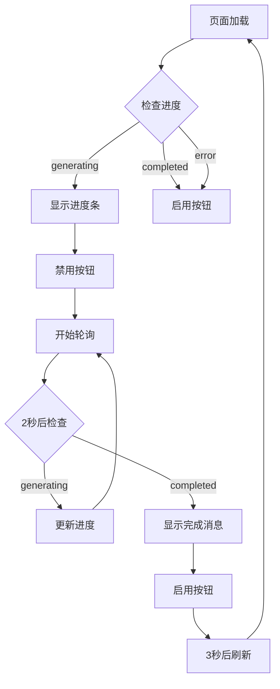

# 进度条自动恢复功能说明

## 📋 问题描述

**用户反馈**："页面刷新了进度条就不见了"

## 🔍 问题分析

### 症状

1. 用户点击"生成报告"
2. 开始生成，显示进度条
3. 用户手动刷新页面（或意外刷新）
4. 页面加载后进度条消失
5. 用户看不到生成进度，以为任务停止了

### 根本原因

在 `DOMContentLoaded` 事件中，原本注释掉了进度检查：

```javascript
// 旧代码
document.addEventListener('DOMContentLoaded', function() {
    loadAuthorsData();
    // 页面加载时不检查进度，避免显示旧的进度条
    // checkProgress();  // ← 被注释掉了
});
```

**为什么这样设计**：
- 避免显示已完成的旧任务进度
- 避免误显示过期的进度信息

**问题**：
- 如果任务正在进行中，页面刷新后会丢失进度显示
- 用户无法看到实时进度
- 可能导致用户重复点击生成按钮

## 🔧 修复方案

### 修复思路

1. **页面加载时自动检查进度**
   - 查询 `/api/progress` 接口
   - 如果状态是 `generating`，自动显示进度条

2. **智能按钮状态管理**
   - 如果有任务在进行，禁用生成按钮
   - 如果没有任务，启用生成按钮
   - 任务完成时，重新启用按钮

3. **自动开始轮询**
   - 检测到任务在进行时，自动调用 `checkProgress()`
   - 持续轮询进度更新

### 修复前代码

```javascript
// 页面加载完成后初始化
document.addEventListener('DOMContentLoaded', function() {
    // 重置生成按钮状态
    const generateBtn = document.getElementById('generateBtn');
    if (generateBtn) {
        generateBtn.disabled = false;
        generateBtn.textContent = '🔄 生成报告';
    }

    loadAuthorsData();
    // 页面加载时不检查进度，避免显示旧的进度条
    // checkProgress();  // ❌ 被注释掉
});
```

### 修复后代码

```javascript
// 页面加载完成后初始化
document.addEventListener('DOMContentLoaded', async function() {
    // 首先检查是否有正在进行的任务
    try {
        const progressResponse = await fetch('/api/progress');
        const progressData = await progressResponse.json();

        // 如果有正在进行的任务，自动显示进度条并禁用按钮
        if (progressData.status === 'generating') {
            console.log('检测到正在进行的任务，自动显示进度条');

            // 禁用生成按钮
            const generateBtn = document.getElementById('generateBtn');
            if (generateBtn) {
                generateBtn.disabled = true;
                generateBtn.textContent = '⏳ 生成中...';
            }

            // 显示进度条
            displayProgress(progressData);

            // 开始轮询进度更新
            checkProgress();  // ✅ 自动开始轮询
        } else {
            // 没有正在进行的任务，重置按钮状态
            const generateBtn = document.getElementById('generateBtn');
            if (generateBtn) {
                generateBtn.disabled = false;
                generateBtn.textContent = '🔄 生成报告';
            }
        }
    } catch (error) {
        console.error('检查进度失败:', error);
        // 出错时也要重置按钮状态
        const generateBtn = document.getElementById('generateBtn');
        if (generateBtn) {
            generateBtn.disabled = false;
            generateBtn.textContent = '🔄 生成报告';
        }
    }

    loadAuthorsData();
});
```

### 任务完成时重新启用按钮

```javascript
function displayProgress(progress) {
    // ... 显示进度 ...

    if (progress.status === 'completed') {
        // 完成时显示完成消息
        progressText.textContent = '✅ 报告生成完成！页面将自动刷新...';

        // 重新启用生成按钮
        const generateBtn = document.getElementById('generateBtn');
        if (generateBtn) {
            generateBtn.disabled = false;
            generateBtn.textContent = '🔄 生成报告';
        }

        // 3秒后刷新页面以加载新报告
        setTimeout(() => {
            location.reload();
        }, 3000);
    }
}
```

## ✅ 修复效果

### 场景1：正常生成流程

```
1. 用户访问页面
   ↓
2. 检查进度：无任务
   ↓
3. 按钮状态：启用
   ↓
4. 用户点击"生成报告"
   ↓
5. 显示进度条，按钮禁用
   ↓
6. 每2秒更新进度
   ↓
7. 完成后刷新页面
```

### 场景2：生成过程中刷新页面（修复前）

```
1. 用户点击"生成报告"
   ↓
2. 开始生成，显示进度条
   ↓
3. 用户刷新页面 (F5)
   ↓
4. 页面重新加载
   ↓
5. ❌ 进度条消失
   ↓
6. ❌ 按钮恢复为"生成报告"
   ↓
7. ❌ 用户不知道任务还在进行
   ↓
8. ❌ 可能重复点击生成
```

### 场景3：生成过程中刷新页面（修复后）

```
1. 用户点击"生成报告"
   ↓
2. 开始生成，显示进度条
   ↓
3. 用户刷新页面 (F5)
   ↓
4. 页面重新加载
   ↓
5. ✅ 自动检查进度：发现任务在进行
   ↓
6. ✅ 自动显示进度条
   ↓
7. ✅ 按钮保持禁用状态："⏳ 生成中..."
   ↓
8. ✅ 自动开始轮询进度更新
   ↓
9. ✅ 用户可以看到实时进度
   ↓
10. 完成后自动刷新
```

## 🎯 工作流程

### 页面加载流程

```
页面加载
  ↓
DOMContentLoaded 事件
  ↓
fetch('/api/progress')
  ↓
检查 status
  ├─ 'generating' → 显示进度条 + 禁用按钮 + 开始轮询
  └─ 'completed' 或其他 → 启用按钮
  ↓
loadAuthorsData()
```

### 进度轮询流程

```
checkProgress() 被调用
  ↓
fetch('/api/progress')
  ↓
displayProgress(data)
  ├─ status === 'generating'
  │  → 更新进度条
  │  → 2秒后再次调用 checkProgress()
  │
  └─ status === 'completed'
     → 显示"完成"消息
     → 重新启用按钮
     → 3秒后刷新页面
```

### 按钮状态管理

```
按钮状态：
  ┌─────────────────────────────────────┐
  │                                     │
  │  启用 (disabled=false)              │
  │    ↓                                │
  │  用户点击"生成报告"                  │
  │    ↓                                │
  │  禁用 (disabled=true)               │
  │    ↓                                │
  │  任务完成                           │
  │    ↓                                │
  │  启用 (disabled=false) ← 完成后恢复 │
  │                                     │
  └─────────────────────────────────────┘
```

## 📊 逻辑流程图



## 🔍 关键改进点

### 1. 异步初始化

```javascript
document.addEventListener('DOMContentLoaded', async function() {
    // 使用 async/await 等待进度检查结果
    const progressResponse = await fetch('/api/progress');
    const progressData = await progressResponse.json();
    // ...
});
```

**好处**：
- 确保在设置按钮状态之前已经获取到最新进度
- 避免异步竞争条件

### 2. 错误处理

```javascript
try {
    const progressResponse = await fetch('/api/progress');
    // ...
} catch (error) {
    console.error('检查进度失败:', error);
    // 出错时也要重置按钮状态
    const generateBtn = document.getElementById('generateBtn');
    if (generateBtn) {
        generateBtn.disabled = false;
        generateBtn.textContent = '🔄 生成报告';
    }
}
```

**好处**：
- 网络错误时不会卡住按钮
- 用户可以重试操作

### 3. 自动轮询启动

```javascript
if (progressData.status === 'generating') {
    displayProgress(progressData);
    checkProgress();  // 自动开始轮询
}
```

**好处**：
- 无需用户手动操作
- 页面刷新后自动恢复进度显示

### 4. 按钮状态同步

```javascript
// 检测到任务在进行 → 禁用按钮
generateBtn.disabled = true;
generateBtn.textContent = '⏳ 生成中...';

// 任务完成 → 启用按钮
generateBtn.disabled = false;
generateBtn.textContent = '🔄 生成报告';
```

**好处**：
- 避免用户重复点击
- 状态与实际任务同步

## 🧪 测试场景

### 测试1：正常生成

```bash
1. 访问 http://localhost:8000
2. 点击"生成报告"
3. 观察进度条正常显示
4. 等待完成
5. 页面自动刷新
```

**预期结果**：
- ✅ 进度条实时更新
- ✅ 按钮显示"⏳ 生成中..."
- ✅ 完成后显示"✅ 报告生成完成！"
- ✅ 3秒后页面刷新

### 测试2：生成过程中刷新页面

```bash
1. 访问 http://localhost:8000
2. 点击"生成报告"
3. 等待进度条显示
4. 按 F5 刷新页面
5. 观察进度条是否自动恢复
```

**预期结果**：
- ✅ 页面加载后自动显示进度条
- ✅ 按钮显示"⏳ 生成中..."
- ✅ 进度从当前位置继续
- ✅ 不会重新开始生成

### 测试3：多标签页

```bash
1. 打开标签页A：http://localhost:8000
2. 打开标签页B：http://localhost:8000
3. 在标签页A点击"生成报告"
4. 切换到标签页B，刷新页面
5. 观察标签页B是否显示进度
```

**预期结果**：
- ✅ 标签页B刷新后自动显示进度条
- ✅ 按钮保持禁用状态
- ✅ 进度实时更新

### 测试4：网络错误处理

```bash
1. 停止服务器
2. 访问 http://localhost:8000
3. 观察按钮状态
```

**预期结果**：
- ✅ 按钮保持启用状态
- ✅ 用户可以重试
- ✅ 不会卡在禁用状态

## 🐛 已知问题

### 1. 进度文件可能过期

**问题**：如果服务器异常退出，进度文件可能显示 `generating` 但实际没有任务在运行

**解决方案**：在 `ReportGenerator` 中有自动清理机制（5分钟超时）

### 2. 多标签页可能显示不一致

**问题**：如果打开多个标签页，每个标签页都会独立轮询进度

**影响**：增加服务器负载，但不影响功能

**优化**：未来可以考虑使用 WebSocket 推送进度

## 📄 修改文件清单

- **[static/js/overview.js](static/js/overview.js)** - 页面加载时自动检查并恢复进度条

## ✅ 总结

### 问题
页面刷新后进度条消失，用户看不到生成进度

### 原因
页面加载时没有检查是否有正在进行的任务

### 解决方案
1. ✅ 页面加载时自动检查进度状态
2. ✅ 如果有任务在进行，自动显示进度条
3. ✅ 禁用生成按钮，避免重复操作
4. ✅ 自动开始轮询进度更新
5. ✅ 任务完成后重新启用按钮

### 效果
- ✅ 页面刷新后自动恢复进度显示
- ✅ 用户随时可以看到实时进度
- ✅ 避免重复点击生成按钮
- ✅ 体验流畅自然

---

**修复时间**: 2025-12-28
**版本**: v1.2.2
**作者**: Claude Code
